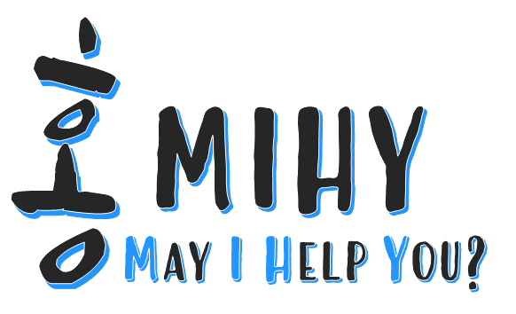
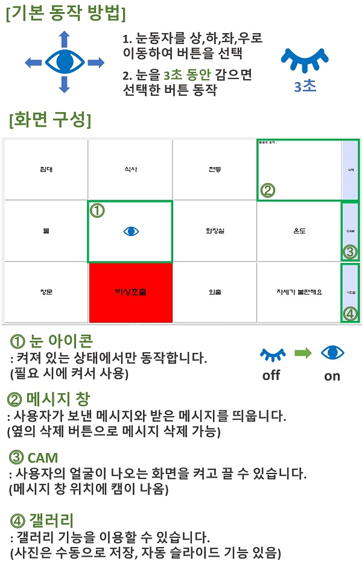
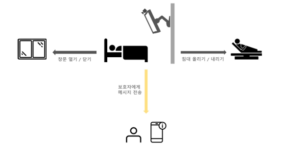
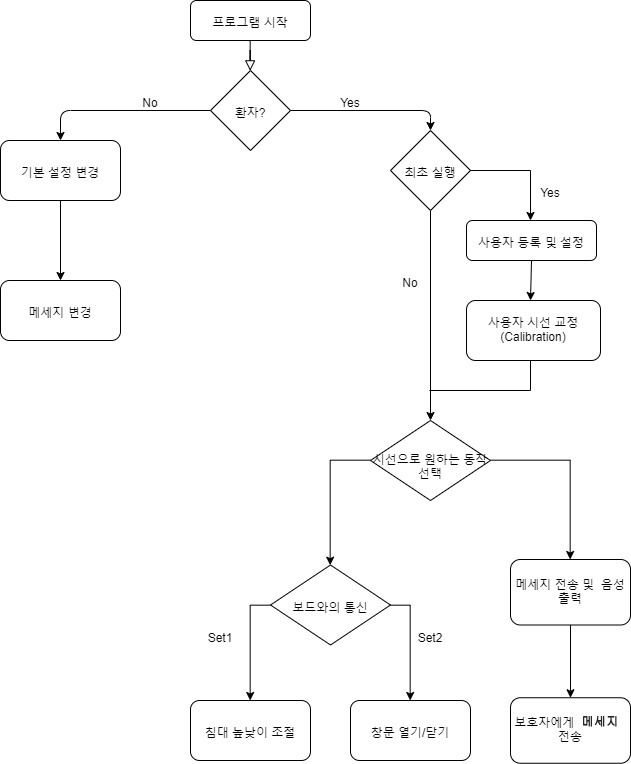
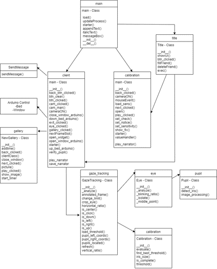

## HongMIHY

</img>

캡스톤 프로젝트로, 시선 추적을 이용한 AAC (Augmentative and Alternative Communication)   

일상 생활에 필요하고 자주 쓰는 문장과 사용자가 직접 등록한 문장을 화면에 디스플레이 하고, 웹 캠을 통해 시선을 추적하여, 사용자 대신 의사를 표현 및 실현해주는 프로그램이다. 문장을 일정 시간 응시하면 해당하는 문장이 음성으로 출력되고, 주위의 간병인이나 의료진들이 들을 수 있다. 또한, 보호자의 페이스북 계정을 등록하여 해당 문장을 메시지로 전송하여 장거리에서도 의사소통을 할 수 돕는다.

** AAC   
: 보완대체의사소통(Augmentative and Alternative Communication)의 약자. 말이나 글을 사용하기 어려운 사람들이 의사 소통할 수 있도록 돕는 기기이다.

## Video

  (https://youtu.be/IqAfY1qU6mM)</img>
   ▲ 이미지를 클릭하면 유튜브 영상으로 연결됩니다.

## How to Use

</img>

## Configuration

</img>

## Flow chart

</img>

## Program Configuration

</img>

